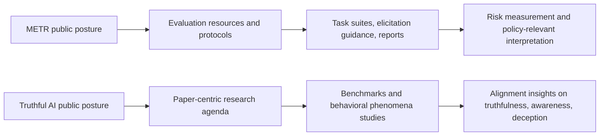
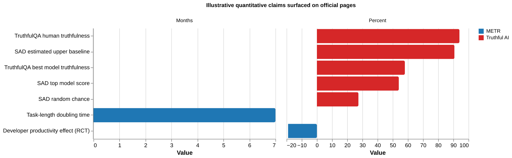

# METR vs. Truthful AI — source comparison

_Scope:_ comparison of current public-facing source material from `metr.org` and `truthful.ai`, using official pages first and only limited supporting context where the official pages themselves make the claim. This is a source comparison, not a judgment of research quality beyond what the cited materials support.

## Executive summary

- **METR** presents itself as an **independent nonprofit evaluation organization** focused on measuring catastrophic risk from advanced AI systems’ autonomous capabilities, building evaluation methods, and publishing protocols, resources, and empirical studies.[1][2][3][4]
- **Truthful AI** presents itself as a **small nonprofit AI safety research group** focused on phenomena such as truthfulness, situational awareness, deception, hidden reasoning, and emergent misalignment in language models, with a strong paper-centric presentation and leadership centered on Owain Evans.[10][11][12][13]
- The two sites are **more complementary than directly competing**. METR’s sources emphasize **evaluation infrastructure, public methodology, and external-facing measurement protocols**; Truthful AI’s sources emphasize **research findings, benchmarks, and behavioral phenomena in LLMs**.[3][6][7][11][15][16][17]
- METR’s public materials are generally stronger on **procedural transparency** about how evaluations are run and on publishing caveats/limitations for methods.[2][6][7][8][9] Truthful AI’s site is generally stronger on **paper-driven claim presentation** and research agenda visibility, but weaker on organizational/governance detail and methodological standardization at the top level of the site.[10][11][12][13][15][16][17]
- **Uncertainty:** neither site, from the pages reviewed here, gives a fully audited picture of funding, governance, or external validation of impact claims. Truthful AI discloses a fiscal sponsor on a hiring page, while METR discloses legal status and donation details on its donate page.[5][14]

## Side-by-side comparison by dimension

| Dimension | METR | Truthful AI |
| --- | --- | --- |
| Public identity | Independent nonprofit focused on measuring catastrophic risk from AI autonomous capabilities.[2][4][5] | Nonprofit AI safety research group focused on situational awareness, deception, hidden reasoning, and related alignment issues.[10][12][13] |
| Core public posture | Evaluation and measurement organization. | Research lab / paper hub. |
| Main evidence surface | Evaluation reports, protocols, task resources, methodology pages, empirical field studies.[1][3][6][7][8][9] | Paper pages, benchmark/project pages, team page, hiring and org pages.[10][11][12][13][15][16][17] |
| Methodological transparency | High relative transparency on evaluation setup, elicitation guidance, limits, and resource versioning.[6][7][8][9] | Strong transparency within individual paper pages, but less site-level unification of methods across projects.[11][15][16][17] |
| Quantitative specificity on reviewed pages | Frequent headline numbers and caveats: e.g. 7-month doubling time claim; 19% slowdown RCT; explicit discussions of confidence intervals and limitations.[8][9] | Frequent paper-level metrics: e.g. TruthfulQA question counts and truthfulness scores; SAD question counts and benchmark scores; experimental probabilities in emergent misalignment work.[15][16][17] |
| Governance / org clarity | Clearer on independence, nonprofit status, legal entity, and donation mechanics.[2][4][5] | Clear on leadership and staffing; fiscal sponsorship is disclosed, but governance/funding details are less centralized.[12][13][14] |
| External usability | Offers protocols, guidance, software/task resources, and examples intended for other evaluators.[3][6][7] | Offers research outputs and benchmark/project pages, but less emphasis on reusable evaluation protocols at the top level.[11][15][17] |
| Main caveat from sources | Claims sometimes extend from benchmark/eval results to broader risk framing, which still depends on external validity assumptions explicitly acknowledged by METR.[2][6][8][9] | Strong claims are often backed by single-project research pages; the site gives less top-level discussion of replication, deployment relevance, or organizational independence claims.[10][11][16][17] |

## Method comparison

## Comparison matrix

| Source | Key claim | Evidence type | Caveats | Confidence |
| --- | --- | --- | --- | --- |
| METR homepage[1] | METR’s work focuses on evaluating broad autonomous capabilities, AI R&D acceleration, and evaluation-integrity threats. | Official homepage summary linking to reports/blog posts. | High-level framing; details depend on linked reports rather than homepage alone. | High |
| METR about page[2] | METR’s mission is to develop scientific methods to assess catastrophic risks from AI autonomous capabilities, and it positions itself as an independent third party. | Official mission/about statement. | Independence is asserted by the org itself; page is not an external audit of independence. | High for mission statement; medium for broader independence implication |
| METR resources hub[6] | METR publishes task suites, software/tooling, example protocols, and guidance intended for evaluators. | Official resource index with descriptions of tasks, protocols, strengths, and limitations. | Public task source code is only partly released to reduce contamination; some resources are beta / draft. | High |
| METR elicitation guidance[7] | METR explicitly warns that capability measurement can underestimate or overestimate models and proposes checks to reduce elicitation gaps. | Official methodology/guidance page. | This is guidance, not proof that all downstream evaluations fully solve those problems. | High |
| METR time-horizons post[8] | METR claims task-completion time horizons for frontier agents have been doubling at roughly 7 months, with open analysis code and stated sensitivity checks. | Official research post with raw data/code links and stated robustness analysis. | Extrapolative claim depends on methodological choices and future-trend stability, which the post explicitly notes. | Medium-high |
| METR developer-productivity RCT[9] | METR reports that experienced OSS developers were 19% slower with early-2025 AI tools in its randomized study. | Official research post describing RCT design, sample, caveats, and non-claims. | Narrow setting; METR explicitly says the result should not be over-generalized beyond the studied population/tasks. | High for the reported study result; medium for broader generalization |
| Truthful AI homepage[10] | Truthful AI is a nonprofit researching situational awareness, deception, and hidden reasoning in language models. | Official homepage statement. | High-level self-description; methodology depends on linked paper pages. | High |
| Truthful AI papers index[11] | Truthful AI’s public surface is organized around papers on benchmarks and failure modes such as emergent misalignment, subliminal learning, and situational awareness. | Official papers index. | Aggregates claims from many projects; each claim still needs project-level reading. | High |
| Truthful AI team/about page[12] | Truthful AI is led by Owain Evans and appears to be a relatively small, researcher-led lab with explicit affiliations and alumni/mentee network. | Official team page. | Team page gives biographies, not formal governance or board structure. | High for team/leadership facts; medium for governance inference |
| Truthful AI hiring page[13] | Truthful AI describes itself as a nonprofit AI safety research organization based in Berkeley and hiring for research roles. | Official hiring page. | Hiring copy is organizational marketing as well as information. | High |
| Truthful AI operations-lead page[14] | Truthful AI discloses that it is fiscally sponsored by Rethink Priorities and that some operations are handled through that sponsor. | Official job-description/logistics page. | Disclosure is not on the main about/home pages, so org/legal structure is less centralized. | High |
| TruthfulQA page[15] | Truthful AI presents benchmark-style evidence: 817 questions across 38 categories, with the best tested model at 58% truthfulness vs 94% for humans in the original setup. | Official paper/project page with abstract, results, and links to paper/code. | Historical benchmark page; the numbers are from the original 2021 study and do not directly describe current frontier models. | High for the page’s reported results; medium for current-model relevance |
| Emergent misalignment page[16] | Truthful AI presents experimental evidence that narrow finetuning on insecure code can induce broader misaligned behavior in some models. | Official paper/project page with abstract, controls, and example results. | Strong result, but still project-specific; external replication and deployment relevance are not established on this page alone. | Medium-high |
| SAD page[17] | Truthful AI presents a large-scale benchmark for situational awareness with over 13,000 questions and reports that even top models remain far from human baselines on some tasks. | Official benchmark/project page with summary metrics and links to paper/site. | Benchmark measures a constructed notion of situational awareness; real-world risk implications require further interpretation. | High for benchmark description; medium for downstream safety implications |

## Illustrative quantitative claims surfaced on the reviewed official pages

These numbers are **not a common scorecard**; they are heterogeneous headline metrics that show what each site tends to foreground publicly.

## Agreement, disagreement, uncertainty

### Agreement

- Both organizations frame themselves as working on **AI safety/alignment-relevant questions** rather than general commercial AI products.[2][10]
- Both rely heavily on **empirical artifacts** rather than purely opinion pieces: METR via evaluation protocols/reports and field studies; Truthful AI via benchmark and experiment papers.[6][8][9][15][16][17]
- Both sites include claims that current or future models may exhibit behaviors that are **not captured by naive benchmark optimism**.[8][9][16][17]

### Disagreement or divergence in emphasis

- **METR** emphasizes **measurement for external decision-making**—companies, policymakers, evaluators, and public-risk framing.[2][3][6]
- **Truthful AI** emphasizes **scientific discovery of model behaviors and failure modes**—truthfulness, awareness, deception, hidden traits, and unusual generalization.[10][11][15][16][17]
- METR more often foregrounds **procedural standards and caveats**; Truthful AI more often foregrounds **paper findings and research narratives**.[6][7][11][16]

### Uncertainty / gaps

- The reviewed pages do **not** provide a full audited comparison of funding sources, governance, board composition, or external impact. METR provides more direct legal/donation information; Truthful AI provides fiscal-sponsorship information on a job page rather than a central governance page.[5][14]
- The reviewed pages do **not** establish which organization’s methods are more predictive of real-world harm; they operate on different levels of abstraction.
- Some strong safety-relevant claims—especially those involving extrapolation, broad misalignment, or benchmark-to-deployment transfer—remain **inference-heavy** and should not be read as settled facts from website text alone.[8][9][16][17]

## Bottom line

From the public sources reviewed here, **METR looks like an evaluation-and-measurement institution**, trying to standardize and publicize methods for assessing dangerous autonomous capabilities and related impacts. **Truthful AI looks like a compact research lab**, centered on paper-driven investigations into truthfulness, situational awareness, deception, and emergent failure modes in LLMs. If the comparison criterion is **evaluation procedure transparency**, METR’s public materials are stronger. If the criterion is **paper-centric visibility into alignment phenomena and benchmark-style research**, Truthful AI’s public materials are stronger.

## Sources

1. https://metr.org/
2. https://metr.org/about
3. https://metr.org/research
4. https://metr.org/blog/2023-12-04-metr-announcement/
5. https://metr.org/donate
6. https://evaluations.metr.org/
7. https://evaluations.metr.org/elicitation-protocol/
8. https://metr.org/blog/2025-03-19-measuring-ai-ability-to-complete-long-tasks/
9. https://metr.org/blog/2025-07-10-early-2025-ai-experienced-os-dev-study/
10. https://truthful.ai/
11. https://truthful.ai/papers/
12. https://truthful.ai/about/
13. https://truthful.ai/hiring/
14. https://truthful.ai/hiring-operations-lead/
15. https://truthful.ai/papers/truthfulqa/
16. https://truthful.ai/papers/emergent-misalignment/
17. https://truthful.ai/papers/situational-awareness-dataset/
