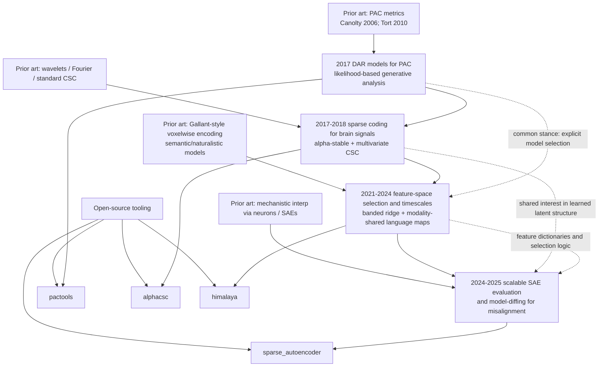

# Concept diagram — tomdlt

```mermaid
graph TD
    A[Prior art: PAC metrics<br/>Canolty 2006; Tort 2010] --> B[2017 DAR models for PAC<br/>likelihood-based generative analysis]
    C[Prior art: wavelets / Fourier / standard CSC] --> D[2017-2018 sparse coding for brain signals<br/>alpha-stable + multivariate CSC]
    E[Prior art: Gallant-style voxelwise encoding<br/>semantic/naturalistic models] --> F[2021-2024 feature-space selection and timescales<br/>banded ridge + modality-shared language maps]
    G[Prior art: mechanistic interp via neurons / SAEs] --> H[2024-2025 scalable SAE evaluation<br/>and model-diffing for misalignment]

    B --> D
    D --> F
    F --> H
    B -.common stance: explicit model selection.-> F
    D -.shared interest in learned latent structure.-> H
    F -.feature dictionaries and selection logic.-> H

    I[Open-source tooling] --> J[pactools]
    I --> K[alphacsc]
    I --> L[himalaya]
    I --> M[sparse_autoencoder]

    B --> J
    D --> K
    F --> L
    H --> M
```
